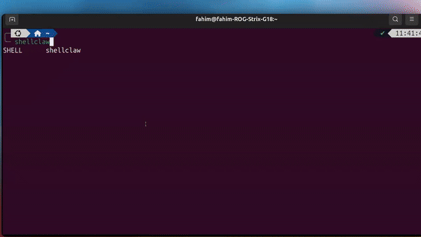

# ShellClaw

[](LICENSE)
[](https://opensource.org/osd)
[](https://www.python.org/downloads/)
[](https://github.com/MDFahimAnjum/shellclaw)

> Optimized terminal agent for every user

ShellClaw is an extremely *lightweight and optimized* LLM-powered terminal assistant TUI for everyday users (not only developers or sysadmins). It diagnoses system problems by running safe read-only commands, explains what it finds in plain English, and proposes solutions.



## Overview

A lightweight harness optimized for terminal workflow and system diagnostics:

- It can run *read-only* safe terminal commands to complete user task
- Native integration with terminal provides full context of the past executed commands
- Can be operated via external devices like phones  

## Quick Install 

```bash
curl -fsSL https://raw.githubusercontent.com/MDFahimAnjum/shellclaw/main/install.sh | bash
```

This Downloads the [install script](https://github.com/MDFahimAnjum/shellclaw/blob/main/install.sh) and runs it. The script fetches the latest release binary for your OS/arch and installs it under `~/.local/bin`. 

You need `curl` and `jq` installed. More options below.

## Who is it for?

### 1. Beginners in terminals
This is designed for people who do not want to write and run terminal commands. Rather, you can just ask the LLM model for the task

### 2. Terminal Users
If you are already proficient in terminal, `ShellClaw` can be very helpful to automate your task. Specially if you want to manage the system from your phone

## Core Features

### **1. Native system context** 
Terminal agent with full awareness of the host OS (paths, services, and environment)

### **2. Terminal-first workflow** 
Runs where you already work, with tight integration into your shell session and command flow.

### **3. Lightweight and fast** 
Small footprint and responsive UI that can run natively on terminal.

### **4. Optimized agentic workflow**
Token-efficient tools and prompts to reduce context window and lower tokens sent to the model. Unlike other heavy-weight harnesses, ShellClaw uses minimal agentic loop and code-level safeguards.

### **5. Small-model friendly** 
Tuned for efficiency so it remains usable with models under ~10B parameters. I developed this while using `Qwen3.5:9B` and `Gamma4:E4B` models.

### **6. Phone messaging**
ShellClaw can be run from mobile devices. We use `SimpleX` platform for this. Why SimpleX? Because it is E2E encrypted (unlike Telegram) and has official CLI tools (unlike WhatsApp).

### **7. Built-in SafeGuards**
There is a very conservation built-in safeguard system that *only allows read operations* to your system. This way, you know that the model can never mess up anything. 

### Subcommands to use `ShellClaw`

```bash
shellclaw                          # Launch the TUI
shellclaw check "sudo rm -rf /tmp" # Analyse a command for safety
shellclaw history                  # Show recent sessions
shellclaw history search wifi      # Search sessions by keyword
shellclaw undo                     # Reverse the last reversible action
shellclaw health                   # Run a manual health scan
```


## More Installation options

Pick one of the following; they all end with the `shellclaw` command on your `PATH`.

### 1. Quick install (curl)

(See above)

### 2. Manual install

If you prefer not to pipe a remote script straight into the shell:

1. **Download the script**, inspect it, then run it locally:

   ```bash
   curl -fsSL https://raw.githubusercontent.com/MDFahimAnjum/shellclaw/main/install.sh -o install.sh
   # review install.sh, then:
   bash install.sh
   ```

2. **Or install only the binary** from [GitHub Releases](https://github.com/MDFahimAnjum/shellclaw/releases): download the asset named `shellclaw-<os>-<arch>` (for example `shellclaw-linux-amd64` on 64-bit Linux), make it executable, and move it to a directory on your `PATH` (for example `~/.local/bin/shellclaw`).

Ensure `~/.local/bin` is on your `PATH` if you use that location (the install script prints a hint if it is not).

### 3. Build from source

Requires **Python 3.11+** and a checkout of this repository.

```bash
git clone https://github.com/MDFahimAnjum/shellclaw.git
cd shellclaw
python -m venv .venv
source .venv/bin/activate
pip install -e ".[dev]"

# Optional but recommended: fetch the tldr-pages dataset for richer help
make data

shellclaw
```

For a standalone binary with PyInstaller (after `pip install -e ".[dev]"`):

```bash
make build    # output: dist/shellclaw
```

## Configuration

On first run, shellclaw walks you through choosing an LLM provider. The config is written to `~/.config/shellclaw/config.toml`. See `config.example.toml` for all available options.

## Development

```bash
make install   # pip install -e ".[dev]"
make data      # download tldr-pages dataset
make test      # run tests
make build     # build PyInstaller binary (local)
```

### Docker (reproducible Linux build and smoke test)

Build the Linux binary inside Docker (older glibc-friendly); artifact is copied to `dist/shellclaw`:

```bash
make docker-build
```

Smoke-test a built binary in a container (adjust the image/path as needed):

```bash
docker run --rm -it -v "$(pwd):/app" ubuntu:22.04 /app/dist/shellclaw
```

For a bind-mount dev/build workflow:

```bash
make docker-build-volume
```

## License

This project is fully open-source MIT. Feel free to contribute or fork as you need, just consider mentioning this repo in your work.
